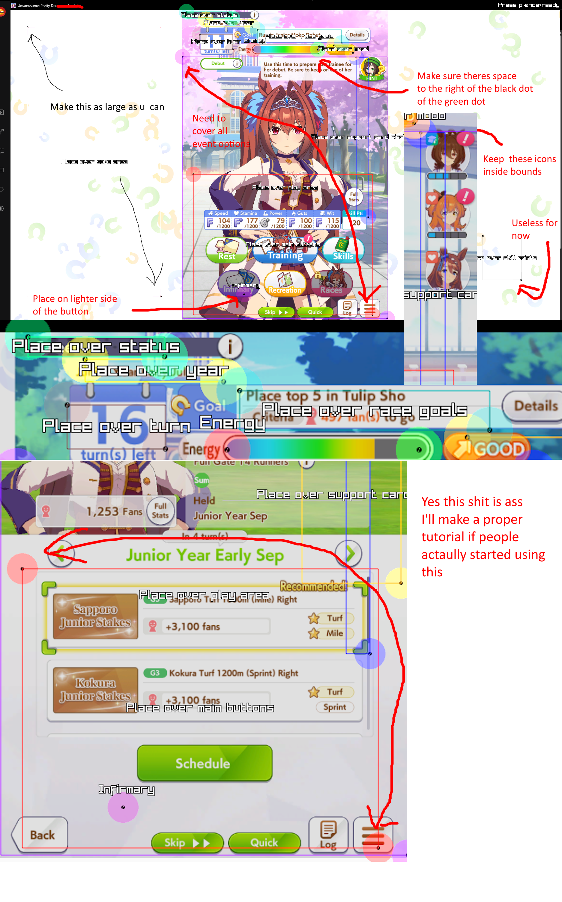

# What is this 

 A autotrainer for umamusume pretty derby global release. Meant to be usable on all screens but most importantly **ANDROID EMULATORS**.

Technically a fork of  [samsulpanjul/umamusume-auto-train](https://github.com/samsulpanjul/umamusume-auto-train)  (not really it got ship of theseused)

# Why emulators.
Q: Will cygames ban you for using bots?\
A: https://umamusume.com/news/100029/

**Why are emulators safe(r)?**\
Because unlike the steam release they dont have a kernel level anti cheat (All your processes are basically transparent) and a guest os cant see whats happening on the host.

Dont try using a windows VM either it HAS to be a MOBILE emulator. If they start tracking your cursor movements YOU ARE FINISHED. (I have tried to make the cursor look more human if you decide to risk it but like why.)

On a mobile emulator they best they can do is time your clicks + their positions and what not . TDLR no concrete evidence. I doubt they will take any action lest they wanna risk false positives.

This works on the steam release but dont even think about it if you value your account.

# Which emulator should I use
Any works but google play games beta is officially supported by cygames (And what I use personally)\
https://play.google.com/googleplaygames/

# What can this do
Not much for now. Can Fully automate a run in theory but can only reach ura with very easy careers (daiwa)\
Will fail very early on the harder careers\
Basically it works but plays very badly for now. No promises on when it will be good.\
Usable if you just wanna grind monies/sparks tho

# How do I use this
Just follow the instructions of the orginal im too lazy to type allat
 [samsulpanjul/umamusume-auto-train](https://github.com/samsulpanjul/umamusume-auto-train)  \
 After ur done run it as usual and position the rectangles as seen here
 

Then hit p to run 

oh and u need to have view results available for all the races

# TODO
Too much to list rn.
